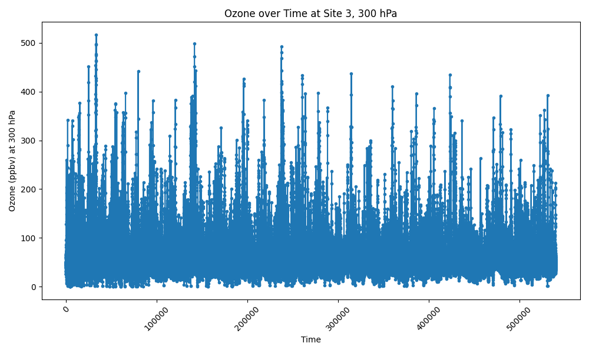

# Atmosphereic Ozone Analysis and Anomaly Detection

A comprehensive machine learning pipeline for identifying unusual ozone measurements across Western North America using multiple statistical and machine learning approaches. This project demonstrates advanced time-series analysis, geospatial visualization, and anomaly detection techniques.

```
1. Data Preparation
* Loaded and cleaned 539808 ozone measurements (1994-2021).
* Engineered cyclical features for temporal analysis.
* Standardized geospatial coordinates.
```
```
2. Methods of Anomaly Detection.
2.1. Linear Regression
2.2. Isolation Forest: Unsupervised anomaly detection using path lengths.
```
```
3. Specific Analysis
3.1. Geographic heat mapping of anomaly distributions.
3.2. Seasonal trend analyssis using cyclical encoding.
3.3. Multi-dimensional visualization (time, space, concentration).
```
```
4. Graphs Plotted
4.1. Distribution of model residuals (Shows the frequency of a particular residual irrespective of location and time of observation).
4.2. Linear fitting of ozone levels with pressure(altitute). (Shows a linear fitting of supposed level of ozone by altitude).
4.3. Interquartile anomalies (Plots anomalies based on a predefined interquartile of normal considered ozone levels.)
4.4. Top n anomalies (Plots the top n anomalies on the linear model irrespective of location and time of observation.)
4.5. Anomaly rate by year (Plots a heatmap of the rate of anomaly in a specific year.)
4.6. Geographic heatmap of anomaly rate by latitude and longitude.
4.7. Anomaly rate by month (Plotted based on the interquartile range.)
4.8. Anomaly rates by latitude and month (Plots anomalies by latitude and longitude for every month (a set of 12 graphs)).
4.9. 3D depiction of anomaly rate by latitude, longitude and month (Same graph as above but in 3D).
```
```
5. Program Structure

Atmospheric_Ozone_Detection_System/
|-- data_loading.py
|-- explore_ozone.py
|-- find_anomalies.py
|-- isolation_tree.py
|-- plot_more_anomalies.py
|-- create_cyclic_encoding.py
|-- main.py
|-- Receptor_western_NAmerica_ozone_obs_1994_2021_from900to300.csv
|-- ozone_data_with_anomalies.csv
|-- ozone_df_with_anomalies.csv
|-- requirements.txt
|-- README.md
|-- .gitignore
|-- figures/
|-- models/
|-- results/
|-- sadvenv/
|-- .vscode/
|-- .git/
```
```
6. Installation
# Clone repository
git clone https://github.com/shoaibaziz-afk/Atmospheric_Ozone_Analysis_And_Anomaly_Detection.git
cd Atmospheric_Ozone_Analysis_And_Anomaly_Detection

# Install dependencies
pip install -r requirements.txt
```
```
7. Run Full Analysis Pipeline
python3 main.py
```
```
8. Individual Analysis Stages
# Run specific components
from explore_ozone import run_linear_regression_analysis
from isolation_tree import run_isolation_tree

data, model = run_linear_regression_analysis()
results = run_isolation_tree(data)
```
```
9. Data Exploration
# Run specific components
from explore_ozone import run_linear_regression_analysis
from isolation_tree import run_isolation_tree

data, model = run_linear_regression_analysis()
results = run_isolation_tree(data)
```
```
10. Contributing
This project follows data science best practices:

Raw data preservation
Modular, reproducible analysis
Comprehensive documentation
Version control with meaningful commits
```
```
11. Future Enhancement: Real Time Ozone Monitoring System
```
```
12. Author
Shoaib Aziz
Aerospace Engineer, Moscow Aviation Instititute (National Research University)
Linkden: www.linkedin.com/in/shoaib-aziz-a02374223
```
```
## Project Screenshot

```
